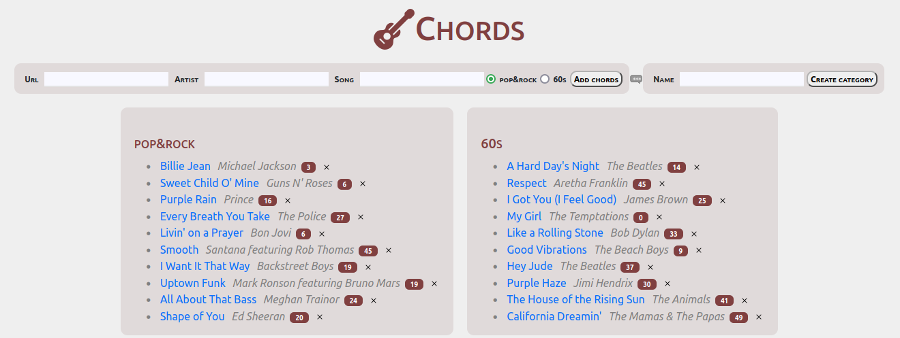

#  ChordsPortal



Build your chords library with ChordsPortal.

It gives you a quick access to the chords you like the best, allows you to create categories, add new chords, and
counts how many times you visit each link.

# Setup

ChordsPortal is a Python/Flask project with some static web content. It uses [pdm](https://github.com/pdm-project/pdm) as a package management tool.


## Install and run local instance

Running locally makes your data persistent.

```bash
$ cd chords_portal
$ pdm install
$ make
```

## Run in a container

RUnning in a container makes your environment ephemeral, but it ensures the service is containerized
and is easy to start.

[Makefile](Makefile) calls [podman](https://docs.podman.io/en/latest/), but
feel free to replace it with [docker](https://docs.docker.com/get-started/02_our_app/).

```bash
$ make build
$ make run
```

This will build an image and run it in a container. It will expose the service on port 5000.

# Access the service

Once you've run the service, visit http://localhost:5000/.

# Data

ChordsPortal uses [TinyDB](https://tinydb.readthedocs.io/en/latest/), a JSON-based datastore which writes [data/chords.json](data/chords.json).

Inspect it with your favorite json viewer, for example:

```bash
$ jq . data/chords.json
```

# Licence

See LICENCE.

[Guitar](https://icons8.com/icon/28KRSpIphgw4/guitar) icon by [Icons8](https://icons8.com).

Icons: https://github.com/twbs/icons MIT licence.
